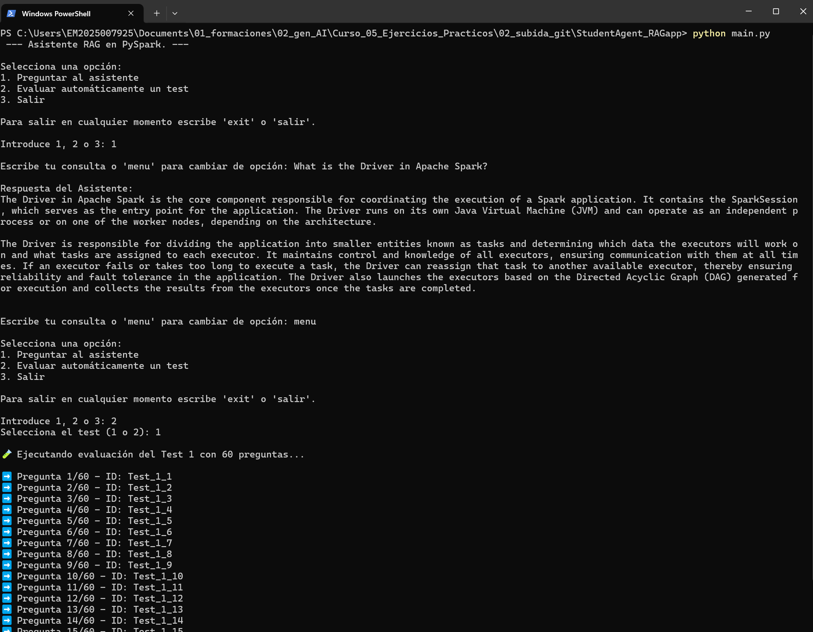
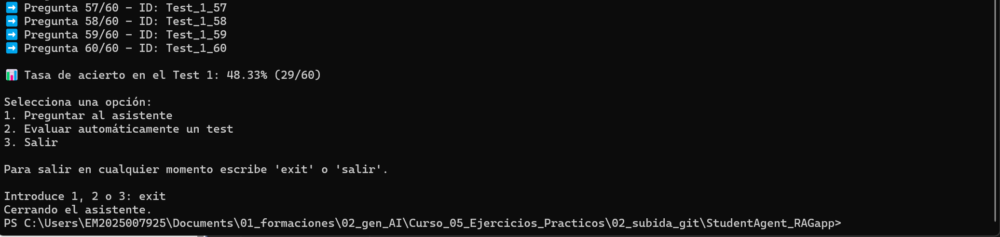

# Asistente de IA: Aplicación RAG sobre temario de Certificación de Apache Spark Databricks.

Este repositorio contiene un proyecto completo para construir y evaluar una aplicación de **Retrieval-Augmented Generation (RAG)** que ayuda a preparar el examen **Databricks Certified Associate Developer for Apache Spark**.

---
## Objetivo del Proyecto

Diseñar un asistente inteligente que responda preguntas sobre el temario oficial del examen, usando un sistema RAG basado en LlamaIndex y modelos OpenAI. La fuente de conocimiento es el libro de estudio oficial en PDF.

---

## Estructura del proyecto. 

+ `data/` : contiene la fuente de datos (fichero .pdf) y los archivos generados por los estudios realizados en el proyecto.
+ `notebooks/`: contiene los notebooks enumerados según la realicación del proyecto, finalizando con la aplicación final RAG.
+ `scripts/`: contiene scripts .py con todas las funciones definidas y documentadas que se utilizan a lo largo del proyecto.
+ `requirements.txt`: Dependencias del entorno.
+ `main.py`: fichero para uso interactivo con la terminal. 

### Funciones definidas en `scripts/`.

+   `scripts/preprocess_data.py`: Contiene funciones de preprocesamiento de texto a partir de documentos PDF de contenido teórico (libro base de estudio). Estas funciones eliminan ruido (como números de página o caracteres raros) y extraen el texto relevante dentro de un rango de páginas.
    +   **Funciones clave**:
        +   `delete_lines_w_digits_only`
        +   `delete_strange_characters`
        +   `remove_trailing_section_by_keywords`
        +   `extract_range_of_pages`

+   `scripts/preprocess_tests.py`: Contiene funciones especializadas en limpiar y estructurar bloques de texto que provienen de secciones de examen dentro del PDF. Su propósito es preparar los datos para que puedan ser convertidos en preguntas tipo test.
    +   **Funciones clave**:
        +  `extract_cleaned_text`
        +  `delete_lines_w_digits_only` (versión para tests)
        +  `delete_strange_characters`
        +  `extract_options`
        +  `extract_questions_from_text`

+   `scripts/scoring_retriever.py`: Contiene funciones para evaluar el comportamiento del sistema RAG en cuanto a recuperación de información (retriever). Permite calcular métricas como similitud entre preguntas y chunks, generar dataframes de puntuaciones y comparar configuraciones de chunking.
    +   **Funciones claves**:
        +   `get_responses_similarity`
        +   `create_score_DataFrame`
        +   `create_score_DataFrame_v2`
        +   `analyze_score_retriever_v2`

+   `scripts/question_prompting.py`: Incluye funciones responsables de construir prompts para preguntas tipo test, formatear opciones, extraer respuestas del modelo y verificar si la respuesta generada es correcta. Esta capa conecta el motor RAG con la lógica del sistema de evaluación.
    +   **Funciones claves**:
        +   `format_options`
        +   `extract_predicted_letter`
        +   `ask_question_with_options`
        +   `ejecutar_test_automatico`

+   `scripts/utilities.py`: Contiene funciones utilitarias para depuración y visualización en consola. Sirven como herramientas de apoyo para inspeccionar resultados y verificar cómo responde el sistema RAG a consultas específicas.
    +   **Funciones claves**:
        +   `run_query_and_inspect`
        +   `display_question_result`

## Fases del proyecto. 

1. **Preprocesamiento del libro.**

+   Se ha recortado el fichero pdf, ubicado en `data/raw_text/`, de forma que se leen y aplanan las páginas correspondientes a la teoría que el modelo LLM debe utilizar para alimentarse.
+   Se procesa y limpia el texto para que sea legible y fácil de comprender por el modelo al ser utilizado como contexto para la respuesta a preguntas del usuario.
+   Una vez se tiene el texto plano limpio, se exporta en `data/plain_text/`

3. **Indexación y Vectorización: Estudio de chunk_size y chunk_overlap óptimos según la similitud del coseno.**

+   Se prueban distintos tamaños de chunks y solapamiento para que, con la creación de un retriever para cada uno de ellos, se eliga el tamaño adecuado que proporciona mejores métricas de similitud. 
+   Para ello, se definen funciones y se generan un excel con la métrica de los nodos devueltos por el retriever, el cual se encuentra en la ruta `data/scores_retriever/`. 
+   Una vez se selecciona el que más sentido y mejor métrica obtenga, se exporta el Index Storage en la ruta `data/index_storage/`.

4. **Evaluación Manual con preguntas de usuario.**

+   Se realizan un banco de preguntas predefinidas para comprobar el comportamiento del modelo LLM.
+   Se definen y afinan prompts de sistema y de mensaje de forma que se limite al LLM al contexto pasado por el retriever.
+   Se validan manualmente los chunks recuperados y la respuesta del modelo. 

5. **Evaluación sobre los Test que recoge el temario.** Para esta parte del proyecto se definen dos procesos y se obtiene la aplicación final, dando lugar a 3 notebooks.

+   `notebooks/04_extract_exams.ipynb`: Proceso similar a la fase 1, se lee el pdf fuente recortado sólo a las páginas con los test de estudio que proporciona el temario. La limpieza y procesado de esta parte es distinta, puesto que se finaliza teniendo una lista de prguntas procesadas como un diccionario de python las cuáles recogen entre otras cosas el test al que pertenece la pregunta, la respuesta correcta a dicha pregunta, y un ID identificativo para la comprobación manual del correcto procesado de las mismas.
+   `notebooks/05_Test2_exams.ipynb`: Este notebook sirve para la evaluación manual del comportamiento de la aplicación RAG al someterla a preguntas de examen. En él, se afinan los prompts para que el modelo no alucine con información no recuperada por el retriever en el contexto, y para que intente justificar con los nodos de contexto la elección de la respuesta final, de esta manera se puede evaluar el comportamiento de la aplicación y si su delimitación al contexto ha sido correcta.
+   `notebooks/06_FINAL_Simplified_RAG.ipynb`: Es el notebook final con los prompts y los chunks considerados óptimos para el objetivo del proyecto. Esta aplicación final será expuesta a un Test completo del libro para así evaluar la tasa de acierto.
+   Los resultados de esta parte del proyecto, están contenidos en el directorio `data/exams_test2/`. 

6. **Creación de script interactivo para el uso de la aplicación desde la terminal.**

+   Una vez se tienen persistido el index_storage, se crea un script `main.py` que permite la interacción del usuario con la configuración final del sistema RAG a través de la terminal. Para ello, se cargan los datos necesarios para el sistema, es decir, se requiere de una API key de OpenAI, y de tener el Index Storage definido óptimo entre los notebooks 02_ y 03_. El script define la configuración y carga una función que es ejecutada al ejecutar el script la cual recibe el input del usuario y muestra la respuesta del modelo. 

## Uso desde la terminal con el fichero `main.py`. 

El asistente RAG puede utilizarse de forma interactiva desde la terminal mediante el script `main.py`, sin necesidad de abrir notebooks. 

### Requisitos previos. 

1. Generar y guardar el índice en `data/index_storage/` ejecutando previamente los notebooks del proyecto, almenos hasta el `02_`. 
2. Tener disponible una clave API de OpenAI en un archivo `.env` en la raíz del proyecto. 

``` 
OPENAI_API_KEY=<clave>
```

3. Instalar las dependencias necesarias definidas en `requirements.txt`

``` {cmd}
pip install -r requirements.txt
```

### Ejecución. 

Desde la raíz del proyecto ejecuta por terminal: 

```
python main.py
```

Se podrán realizar consultas relacionadas con PySpark, todas las que se deseen. Además, se puede realizar la evaluación de un examen test a elección. 

Para salir del asistente basta con escribir 'exit', aunque también tolerará 'salir'. 

### Ejemplo de uso





## Consideraciones. 

La aplicación se basa en la información recuperada de los nodos para responder preguntas, no utiliza información previa que pueda "conocer" el modelo LLM utilizado. Con esto, se entiende que algunas preguntas de razonar no sean respondidas correctamente por el modelo, de igual forma se le permite razonar en base a los chunks devueltos. 

Se consideró realizar la separación de chunks utilizando el índice del libro para aportar información sobre meta-datos de cada chunk. Finalmente, se descartó porque no se consiguieron mejores métricas que con una división típica, se premia la sencillez con mejor resultado sobre la complejidad por un resultado no mucho mejor.
